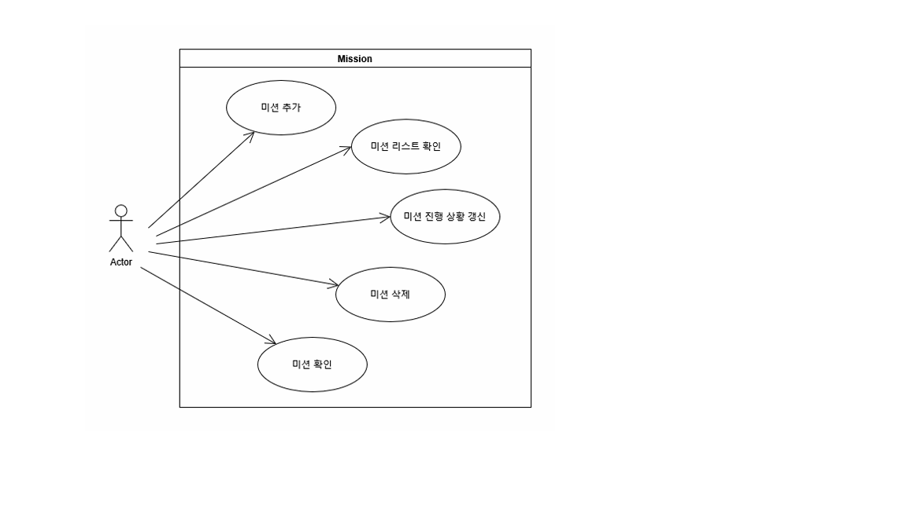

# Daily Weekly Mission

일일 미션과 주간 미션을 한 화면에서 확인하고 관리하기 위한 WPF 기반 미션 관리 앱입니다. 사용자는 반복적으로 수행해야 하는 일을 미션 형태로 등록하고, 완료 상태와 진행 기록을 확인할 수 있습니다.

## 주요 기능

- 일일 미션과 주간 미션 구분 등록
- 미션 목록 확인
- 미션 완료 상태 체크
- 미션 삭제
- 미션 기록 및 진행 상태 확인

## 유스케이스

사용자는 메인 화면에서 현재 등록된 일일/주간 미션을 확인합니다. 미션 추가 화면에서는 미션 내용, 기간, 횟수, 주간 미션의 수행 요일 등을 입력해 새 미션을 등록합니다. 메인 화면에서는 미션 완료 처리와 삭제가 가능하며, 기록 화면에서는 누적 완료 이력과 진행 상태를 확인합니다.

## 프로젝트 구조

이 프로젝트는 WPF와 MVVM 패턴을 기준으로 구성합니다.

- `Windows`: 화면을 담당하며 ViewModel을 `DataContext`로 연결합니다.
- `ViewModels`: 화면 상태와 Command를 관리합니다.
- `Models`: 미션, 미션 타입, 완료 기록, 진행 상태를 표현합니다.
- `Repositories`: 미션과 완료 기록 저장소 역할을 담당합니다.
- `Commands`: 저장, 삭제, 완료 처리, 창 열기 같은 사용자 동작을 처리합니다.
- `Services/Time`: 현재 날짜와 일일/주간 기간 계산을 담당합니다.

## 클래스 다이어그램

클래스 구조와 각 클래스의 상세 설명은 아래 문서에서 확인할 수 있습니다.

- [Class Diagram](docs/diagrams/class/class-diagram.md)
- [Class Definitions](docs/diagrams/class/class-definitions.md)

## 기술 스택

- C#
- WPF
- .NET 10
- MVVM Pattern

## 문서

- [프로젝트 개요](docs/overview/project-overview.md)
- [화면 Mockup](docs/mockups/화면%20디자인(MockUp)%2035878ac9a7988097922ace2981bf20bd.md)
- [유스케이스 다이어그램](docs/diagrams/usecase/usecase.png)
