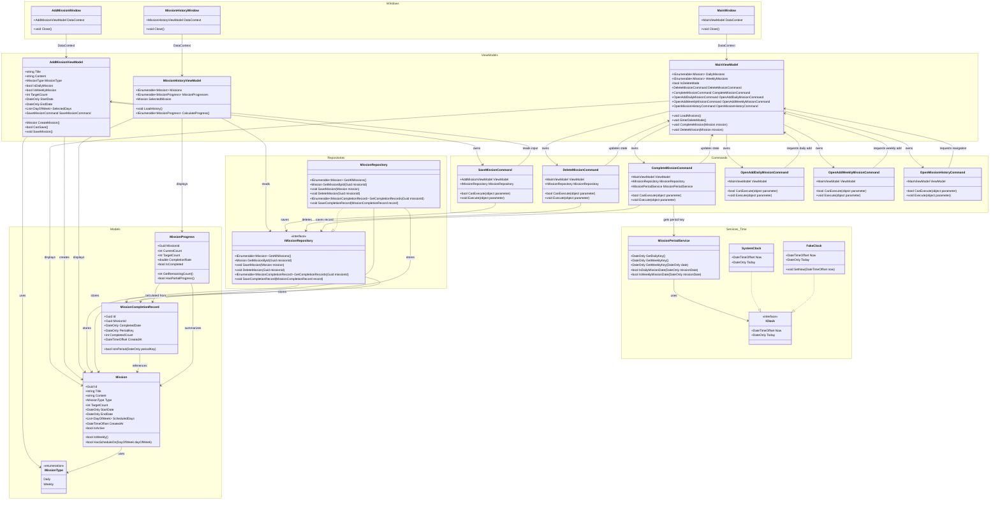

# Class Diagram

```mermaid
classDiagram
    namespace Windows {
        class MainWindow {
            +MainViewModel DataContext
            +void Close()
        }
        class AddMissionWindow {
            +AddMissionViewModel DataContext
            +void Close()
        }
        class MissionHistoryWindow {
            +MissionHistoryViewModel DataContext
            +void Close()
        }
    }

    namespace ViewModels {
        class MainViewModel {
            +IEnumerable~Mission~ DailyMissions
            +IEnumerable~Mission~ WeeklyMissions
            +bool IsDeleteMode
            +DeleteMissionCommand DeleteMissionCommand
            +CompleteMissionCommand CompleteMissionCommand
            +OpenAddDailyMissionCommand OpenAddDailyMissionCommand
            +OpenAddWeeklyMissionCommand OpenAddWeeklyMissionCommand
            +OpenMissionHistoryCommand OpenMissionHistoryCommand
            +void LoadMissions()
            +void EnterDeleteMode()
            +void CompleteMission(Mission mission)
            +void DeleteMission(Mission mission)
        }
        class AddMissionViewModel {
            +string Title
            +string Content
            +MissionType MissionType
            +bool IsDailyMission
            +bool IsWeeklyMission
            +int TargetCount
            +DateOnly StartDate
            +DateOnly EndDate
            +List~DayOfWeek~ SelectedDays
            +SaveMissionCommand SaveMissionCommand
            +Mission CreateMission()
            +bool CanSave()
            +void SaveMission()
        }
        class MissionHistoryViewModel {
            +IEnumerable~Mission~ Missions
            +IEnumerable~MissionProgress~ MissionProgresses
            +Mission SelectedMission
            +void LoadHistory()
            +IEnumerable~MissionProgress~ CalculateProgress()
        }
    }

    namespace Models {
        class Mission {
            +Guid Id
            +string Title
            +string Content
            +MissionType Type
            +int TargetCount
            +DateOnly StartDate
            +DateOnly EndDate
            +List~DayOfWeek~ ScheduledDays
            +DateTimeOffset CreatedAt
            +bool IsActive
            +bool IsWeekly()
            +bool HasScheduleOn(DayOfWeek dayOfWeek)
        }
        class MissionType {
            <<enumeration>>
            Daily
            Weekly
        }
        class MissionCompletionRecord {
            +Guid Id
            +Guid MissionId
            +DateOnly CompletedDate
            +DateOnly PeriodKey
            +int CompletedCount
            +DateTimeOffset CreatedAt
            +bool IsInPeriod(DateOnly periodKey)
        }
        class MissionProgress {
            +Guid MissionId
            +int CurrentCount
            +int TargetCount
            +double CompletionRate
            +bool IsCompleted
            +int GetRemainingCount()
            +bool HasPartialProgress()
        }
    }

    namespace Repositories {
        class IMissionRepository {
            <<interface>>
            +IEnumerable~Mission~ GetAllMissions()
            +Mission GetMissionById(Guid missionId)
            +void SaveMission(Mission mission)
            +void DeleteMission(Guid missionId)
            +IEnumerable~MissionCompletionRecord~ GetCompletionRecords(Guid missionId)
            +void SaveCompletionRecord(MissionCompletionRecord record)
        }
        class MissionRepository {
            +IEnumerable~Mission~ GetAllMissions()
            +Mission GetMissionById(Guid missionId)
            +void SaveMission(Mission mission)
            +void DeleteMission(Guid missionId)
            +IEnumerable~MissionCompletionRecord~ GetCompletionRecords(Guid missionId)
            +void SaveCompletionRecord(MissionCompletionRecord record)
        }
    }

    namespace Commands {
        class SaveMissionCommand {
            +AddMissionViewModel ViewModel
            +IMissionRepository MissionRepository
            +bool CanExecute(object parameter)
            +void Execute(object parameter)
        }
        class DeleteMissionCommand {
            +MainViewModel ViewModel
            +IMissionRepository MissionRepository
            +bool CanExecute(object parameter)
            +void Execute(object parameter)
        }
        class CompleteMissionCommand {
            +MainViewModel ViewModel
            +IMissionRepository MissionRepository
            +MissionPeriodService MissionPeriodService
            +bool CanExecute(object parameter)
            +void Execute(object parameter)
        }
        class OpenAddDailyMissionCommand {
            +MainViewModel ViewModel
            +bool CanExecute(object parameter)
            +void Execute(object parameter)
        }
        class OpenAddWeeklyMissionCommand {
            +MainViewModel ViewModel
            +bool CanExecute(object parameter)
            +void Execute(object parameter)
        }
        class OpenMissionHistoryCommand {
            +MainViewModel ViewModel
            +bool CanExecute(object parameter)
            +void Execute(object parameter)
        }
    }

    namespace Services_Time {
        class IClock {
            <<interface>>
            +DateTimeOffset Now
            +DateOnly Today
        }
        class SystemClock {
            +DateTimeOffset Now
            +DateOnly Today
        }
        class FakeClock {
            +DateTimeOffset Now
            +DateOnly Today
            +void SetNow(DateTimeOffset now)
        }
        class MissionPeriodService {
            +DateOnly GetDailyKey()
            +DateOnly GetWeeklyKey()
            +DateOnly GetWeeklyKey(DateOnly date)
            +bool IsDailyMissionDate(DateOnly missionDate)
            +bool IsWeeklyMissionDate(DateOnly missionDate)
        }
    }

    MainWindow --> MainViewModel : DataContext
    AddMissionWindow --> AddMissionViewModel : DataContext
    MissionHistoryWindow --> MissionHistoryViewModel : DataContext

    MainViewModel --> Mission : displays
    MainViewModel --> DeleteMissionCommand : owns
    MainViewModel --> CompleteMissionCommand : owns
    MainViewModel --> OpenAddDailyMissionCommand : owns
    MainViewModel --> OpenAddWeeklyMissionCommand : owns
    MainViewModel --> OpenMissionHistoryCommand : owns
    AddMissionViewModel --> SaveMissionCommand : owns
    AddMissionViewModel --> Mission : creates
    AddMissionViewModel --> MissionType : uses
    MissionHistoryViewModel --> Mission : displays
    MissionHistoryViewModel --> MissionProgress : displays
    MissionHistoryViewModel --> IMissionRepository : reads

    SaveMissionCommand --> AddMissionViewModel : reads input
    SaveMissionCommand --> IMissionRepository : saves
    DeleteMissionCommand --> MainViewModel : updates state
    DeleteMissionCommand --> IMissionRepository : deletes
    CompleteMissionCommand --> MainViewModel : updates state
    CompleteMissionCommand --> IMissionRepository : saves record
    CompleteMissionCommand --> MissionPeriodService : gets period key
    OpenAddDailyMissionCommand --> MainViewModel : requests daily add
    OpenAddWeeklyMissionCommand --> MainViewModel : requests weekly add
    OpenMissionHistoryCommand --> MainViewModel : requests navigation

    MissionRepository ..|> IMissionRepository
    IMissionRepository --> Mission : stores
    IMissionRepository --> MissionCompletionRecord : stores
    MissionRepository --> Mission : stores
    MissionRepository --> MissionCompletionRecord : stores

    Mission --> MissionType : uses
    MissionCompletionRecord --> Mission : references
    MissionProgress --> Mission : summarizes
    MissionProgress --> MissionCompletionRecord : calculated from

    MissionPeriodService --> IClock : uses
    SystemClock ..|> IClock
    FakeClock ..|> IClock
```
