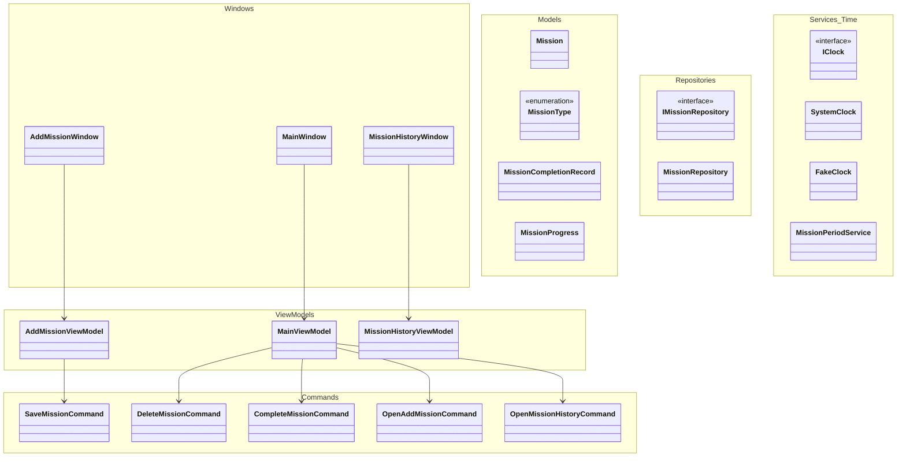

# Class Diagram

```mermaid
classDiagram
    namespace Windows {
        class MainWindow
        class AddMissionWindow
        class MissionHistoryWindow
    }

    namespace ViewModels {
        class MainViewModel
        class AddMissionViewModel
        class MissionHistoryViewModel
    }

    namespace Models {
        class Mission
        class MissionType {
            <<enumeration>>
        }
        class MissionCompletionRecord
        class MissionProgress
    }

    namespace Repositories {
        class IMissionRepository {
            <<interface>>
        }
        class MissionRepository
    }

    namespace Commands {
        class SaveMissionCommand
        class DeleteMissionCommand
        class CompleteMissionCommand
        class OpenAddMissionCommand
        class OpenMissionHistoryCommand
    }

    namespace Services_Time {
        class IClock {
            <<interface>>
        }
        class SystemClock
        class FakeClock
        class MissionPeriodService
    }

    MainWindow --> MainViewModel
    AddMissionWindow --> AddMissionViewModel
    MissionHistoryWindow --> MissionHistoryViewModel

    MainViewModel --> DeleteMissionCommand
    MainViewModel --> CompleteMissionCommand
    MainViewModel --> OpenAddMissionCommand
    MainViewModel --> OpenMissionHistoryCommand
    AddMissionViewModel --> SaveMissionCommand
```
