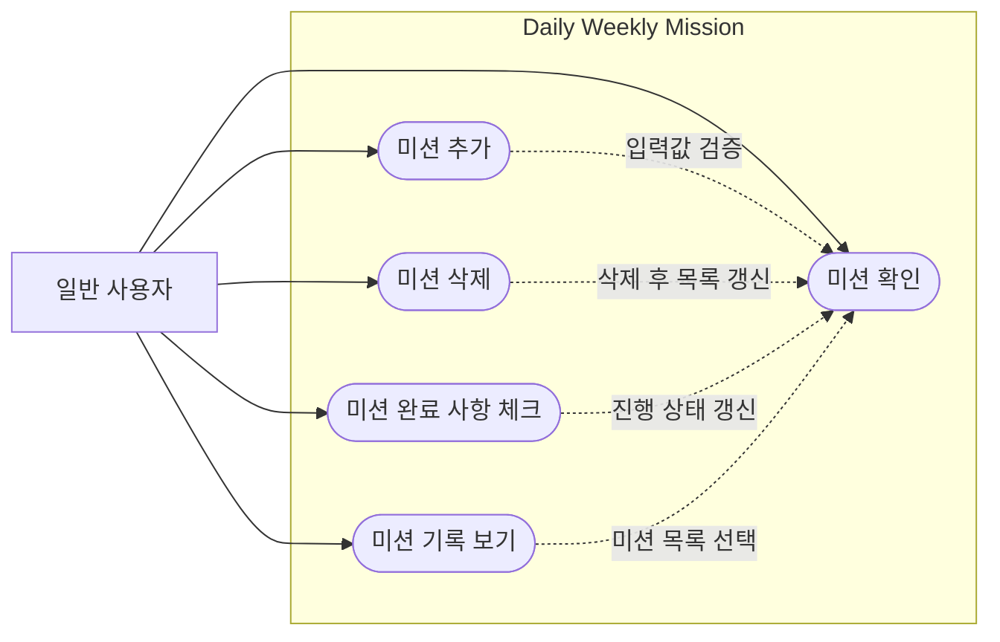

# 유스케이스 다이어그램

이 다이어그램은 `docs/overview/usecase_definition.md`의 유스케이스 명세서를 기준으로 작성한 Mermaid 기반 유스케이스 다이어그램입니다.

## 유스케이스 목록

| 유스케이스 | 설명 |
|---|---|
| 미션 확인 | 메인 화면에서 등록된 일일/주간 미션과 진행 상태를 확인한다. |
| 미션 추가 | 사용자가 일일 또는 주간 미션을 새로 등록한다. |
| 미션 삭제 | 사용자가 삭제 모드에서 원하는 미션을 삭제한다. |
| 미션 완료 사항 체크 | 사용자가 완료한 미션을 체크하여 진행 횟수와 완료 상태를 갱신한다. |
| 미션 기록 보기 | 사용자가 지난 미션 완료 기록을 달력 형태로 확인한다. |