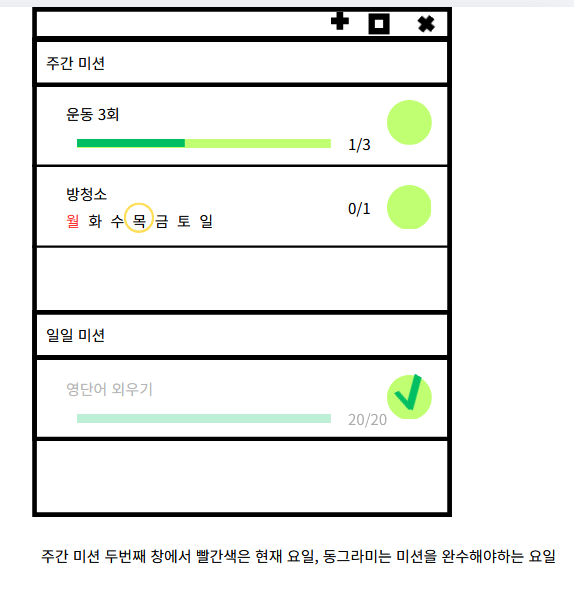

# 화면 디자인(MockUp)

상태: 시작 전

화면 디자인 (미완)

[https://www.canva.com/design/DAHI3wKyfkc/yQy7WczYaDNmcgMWuILegQ/edit?ui=eyJFIjp7IkE_IjoiTiIsIlMiOiJNb2NrdXBzIn19](https://www.canva.com/design/DAHI3wKyfkc/yQy7WczYaDNmcgMWuILegQ/edit?ui=eyJFIjp7IkE_IjoiTiIsIlMiOiJNb2NrdXBzIn19)

1. 메인 미션 창

앱을 실행하였을 때 가장 먼저보이는 창이다.

UI는 크게 두가지  주간 미션, 일일 미션 구역으로 나뉘며 각 구역은 여러개의 미션을 갖을 수 있다. 기본적으로 미션은 내용, 진행 상황 (진행 바, 버튼 활성화), 완료 상태를 갖는다. 사용자가 미션을 완료할 경우 미션의 오른쪽 원에 체크 표시가 생기고 해당 미션은 비활성화 된다.

가장 상단의 +, ㅁ, x는 각각 미션 추가, 미션 기록 보기, 창 닫기 버튼이다.

주간 미션은 일주일을 기준으로 만들어진 미션들이 존재한다. 횟수로 정해진 미션과 요일을 기준으로 만들어진 미션 두가지가 있다. 그림의 예와 같이 운동 3회 주간 미션이 있으며 지금 1회를 만족한 상황이다. 3번 완료할 경우 미션은 완료 된다. 방 청소 미션의 경우 일주일 중 미션을 행하는 요일이 정해진 경우이다. 요일이 써진 텍스트 중 색이 다른 텍스트는 현재 요일을 의미하며 동그라미가 있는 요일은 미션을 수행해야 할 요일을 의미한다.
주간 미션은 새로운 주로 넘어갈 때 초기화 된다.

일일 미션의 경우 주간에서 횟수로 정해진 미션과 동일하다. 미션을 완료할 경우 우측 동그라미에 체크표시가 생긴 것과 진행 바와 텍스트가 비활성화 됨을 알 수 있다.

1. 미션 추가 창
메인 화면에 들어갈 미션을 추가하는 창이다.
기본적으로 내용, 기간, 횟수 3가지를 텍스트 박스에 입력한 뒤 하단의 확인 버튼을 클릭하여 미션을 추가한다.
주간 버튼을 누르면 요일을 선택할 수 있는 요소가 추가 된다.

1. 미션 기록 창 (미완, 추가예정)

미션 기록을 볼 수 있는 창이다. 앱을 처음 사용한 순간부터 현재까지 어떤 미션을 얼마나 완료해 왔는지 확인이 가능하다. (아직 미완성인 부분이다. )

시각적 기본 기능 사항

- 일간, 주간 구분
- 미션 추가 및 삭제
- 미션 제목
- 미션 내용
- 진행 상황(막대바, 원형, % 등)
- 완료 확인 (컬러, 체크 등)

추가적인 사항

- 요일 표시
- 알람
- 이력 표시

예시 이미지들

- 마이 하빗 (app)
    
    
    
- 크레이지 아케이드 (game)
    
    
    
- 원신 (game)
    
    
    
- 로스트 아크 (game)
    
    
    
    미션 창
    
    
    
    축소된 미션 창
    
- 데일리 스케줄 (app)
    
    